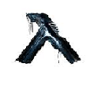

# Save Coordinates Fabric Mod

## Dependencies

This mod|Minecraft|[Fabric API](https://www.curseforge.com/minecraft/mc-mods/fabric-api/files)|[Mod Menu](https://www.curseforge.com/minecraft/mc-mods/modmenu/files) (optional)
--|--|--|--
**1.20.1-1.4.1**|**1.20.1+**|**0.85.0+1.20.1**|**7.1.0**
1.19.2-1.3.1|1.19.2+|0.60.0+1.19.2|4.1.0
1.18.1-1.3.0|1.18.x|0.44.0+1.18|3.0.0
1.17.1-1.2.1|1.17.1|0.41.0+1.17|2.0.14
1.17-1.1.1 |1.17.1|0.34.9+1.17+|2.0.2
1.17-1.1.1 |1.17|0.34.9+1.17+|2.0.0-beta.7+
1.16.5-1.1.0 |1.16.5|0.34.2+1.16+|1.16.9+

 

## Saving a new coordinate

- Press `H` to open menu to save a coordinate. 
- You can manually enter the coordinates and change the dimension by clicking on the text below the current dimension icon.
- Provide a world name and some description.
- Select  to ping the coordinate to other players.
- Select `SAVE` to save the coordinate.

 

## Managing coordinates

- Press `J` or select `LIST` to open the list of coordinates.
- Select  in list view to ping that coordinate to other players.
- Select  to convert the coordinate to nether (or vice versa)

## Broadcasting current location

- Press `B` to broadcast current location
- Press `N` to lock broadcasting current location

## Configs

- Select `CONF` in any window to update configs. 
- This is reachable through mod menu as well when available.

## Discord

https://discord.gg/9xnv2gQbJt
